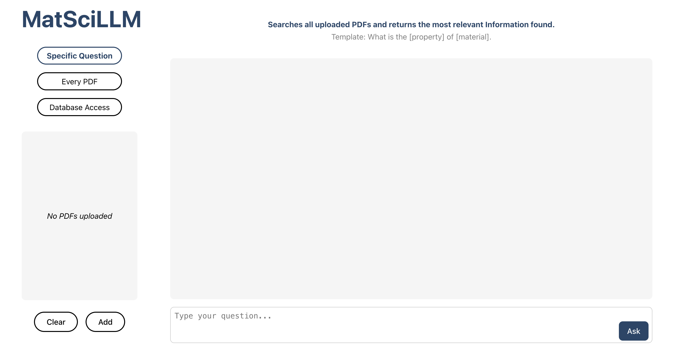

# MatSciLLM

**MatSciLLM** is primarly an LLM-based application designed for material science research, enabling content extraction and analysis from PDFs along with access to the [Materials Project](https://materialsproject.org) Database.



## Features

- **User Interface** - User-friendly chat interface with convenient PDF management.

- **Specific Question** - Extracts the most relevant content from all uploaded PDFs based on a provided query.

- **Every PDF** - Provides answers to the query for each PDF individually.

- **Database Access** - Retrieves all unique stable element combinations for a given material from [Materials Project](https://materialsproject.org) (expandable).

## Setup

This repository includes Makefile for easy installation.

> **Note:** Make sure Make is installed and Ollama (llama3:latest) is running.

1. **Add API Key**  
   Insert your [Materials Project API key](https://next-gen.materialsproject.org/api) into the `.env.example` file. This key is required for accessing the Materials Project API.

2. **Create `.env` File**  
   Copy `.env.example` to `.env` to set up environment variables. 
    ```bash 
    cp .env.example .env
    ```

3. **Install dependencies**  
   Use the provided Makefile to install dependencies.
   > **Note:** For Python, it’s recommended to create and activate a virtual environment before running this.  
   ```bash 
   make install
   ```

4. **Run application**  
   Start the application using the Makefile, then open the application at the specified localhost address.
   ```bash 
   make run
   ```

    &nbsp;

> Notes: 
> - To stop the application, press `Ctrl + C` in the terminal.
> - Alternatively, you can use a different LLM model by changing the `model_name` parameter in the following functions:
>   - `backend/dbMP.py` → `llm_extract_element(LLM_MODEL=...)`
>   - `backend/rag_chain.py` → `build_rag_chain(model_name=...)`
>   - `backend/rag_summarizer.py` → `build_rag_summarizer(model_name=...)`